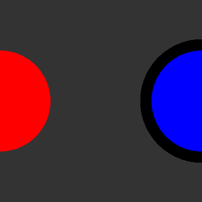
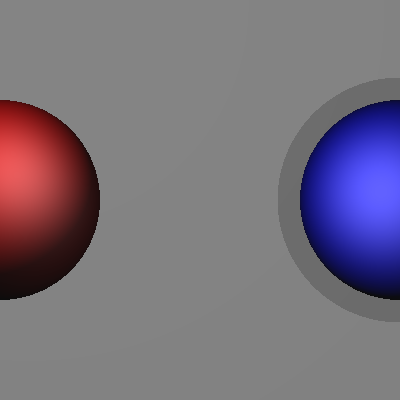
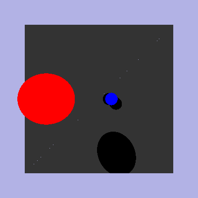
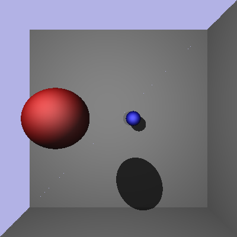
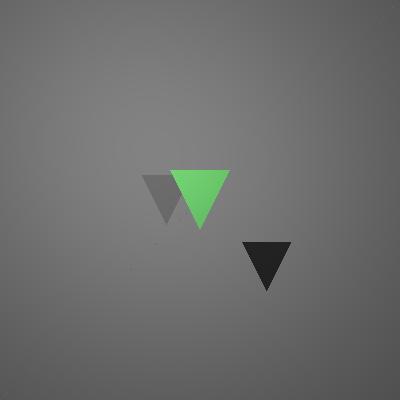
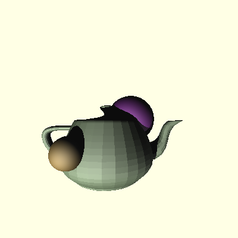

# project-3-starter
Project 3: raytracer with shadows

Group members:

Christopher Ta cta002@csu.fullerton.edu

Flat shader with shadows

Blinn-Phong Shader with shadows and light intensity

'make' => spheres and triangles

'make all' => spheres, triangles, and teapot

## Screenshots

 

 

 

 

